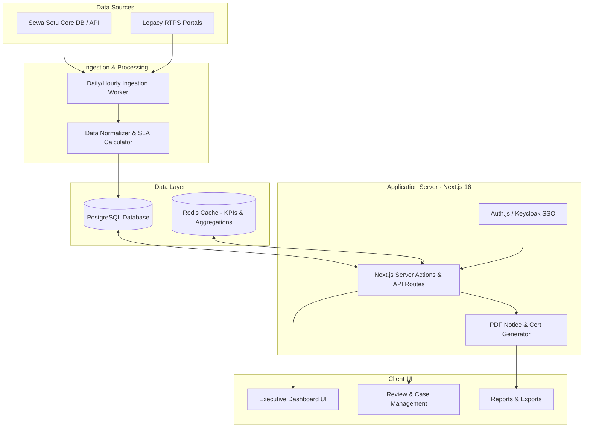
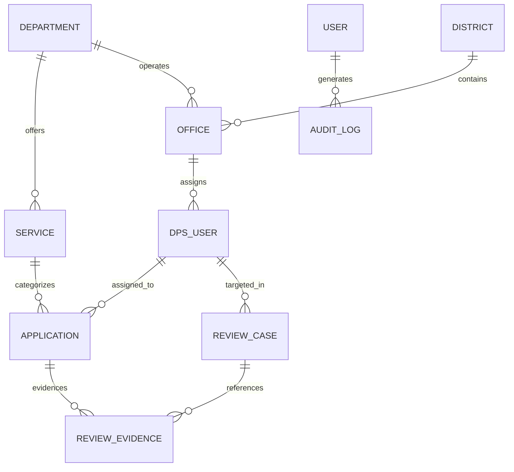
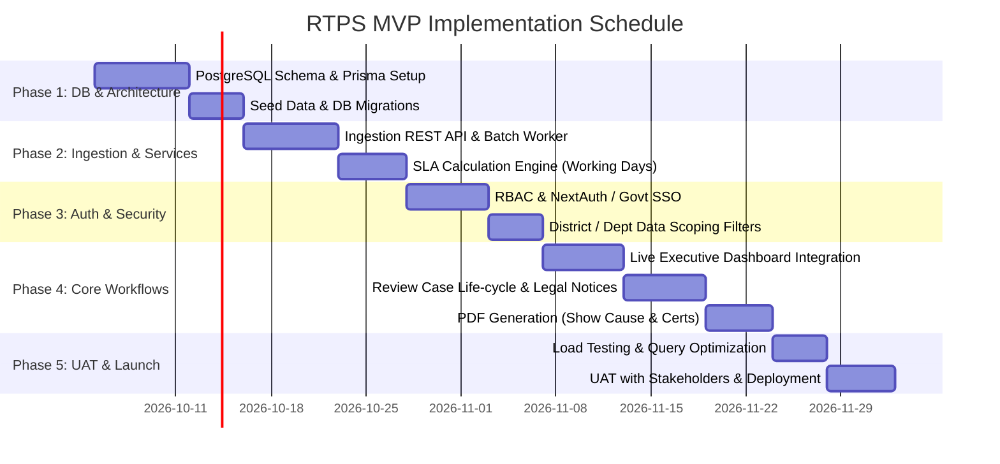

# Assam RTPS Executive Monitoring Dashboard
## Minimum Viable Product (MVP) Specification & Execution Blueprint

**Document Version:** 1.0.0  
**Status:** Under Review (Awaiting Stakeholder Customization)  
**Project:** Assam Right to Public Services (RTPS) / Sewa Setu Performance & Accountability System  
**Target Delivery Horizon:** 6–8 Weeks  

---

## 1. Executive Summary & Vision

### 1.1 Context & Problem Statement
The Assam Right to Public Services (RTPS) Act mandates time-bound delivery of government-to-citizen (G2C) services (e.g., certificates, land mutations, trade licenses, permits). While the existing **Sewa Setu** portal processes applications, leadership (Chief Secretary, Administrative Secretaries, District Commissioners) previously lacked an actionable, real-time command dashboard to:
1. Identify systemic pendency bottlenecks across 35+ districts and 300+ circle/block offices.
2. Intervene proactively before applications breach statutory SLA deadlines (e.g. at the 24h/12h threshold).
3. Enforce administrative accountability on chronic non-performing Designated Public Servants (DPS) via formal review notices.
4. Reward and incentivize high-performing officers with merit commendations.

### 1.2 MVP Objective
Transition the current interactive high-fidelity Next.js prototype into a secure, scalable, multi-tenant MVP connected to real database backends and live RTPS ingestion feeds, providing executive visibility, automated breach warnings, and legal review workflows.

---

## 2. Current Prototype Baseline vs. Target MVP Scope

```
┌─────────────────────────────────────┐         ┌──────────────────────────────────────┐
│       CURRENT PROTOTYPE             │         │             TARGET MVP               │
├─────────────────────────────────────┤         ├──────────────────────────────────────┤
│ • Next.js 16 (App Router) + Tailwind│         │ • Real Database (PostgreSQL + Prisma)│
│ • Mock Data in memory (data.ts)     │         │ • Live Ingestion (REST API / Worker) │
│ • Client-side UI state filters      │ ──────> │ • Server-side Filtering & Pagination │
│ • Visual Review Notice Modal        │         │ • Legally Formatted PDF Notice Engine│
│ • Static DPS & Office rankings      │         │ • Role-Based Access Control (RBAC)   │
│ • Recharts analytics visualization │         │ • Audit Trail & Event Logging        │
└─────────────────────────────────────┘         └──────────────────────────────────────┘
```

| Area | Current Prototype State | Target MVP Capability |
| :--- | :--- | :--- |
| **Data Layer** | Static TypeScript object (`mockData`) | Relational DB (PostgreSQL) with automated ETL/Ingestion pipeline |
| **Authentication** | Simulated role toggle in header | Secure Auth (Govt SSO / Keycloak / NextAuth) with strict RBAC |
| **Review Workflow** | Local React state modal | Persistent Show-Cause notice life-cycle with digital dispatch & reply upload |
| **Export Engine** | Mock button handlers | Real PDF generator (official stamp/watermark) and CSV/Excel exports |
| **Alerts & Warnings** | Static badge indicators | Dynamic SLA countdown, automated email/SMS escalation triggers |
| **Granularity** | Curated subset of ~10 offices/officers | Scalable to all 35 Districts, 180+ Circles, 500+ DPS officers |

---

## 3. Scope Definition (MoSCoW Prioritization)

### 3.1 P0: Must-Have for MVP Launch

#### A. Executive Dashboard & Cross-Filtering
- **State-wide KPI Cards:** Total Applications Received, SLA Compliance Rate (%), Active Breaches, At-Risk (<48h), Delivered in SLA, Average TAT (Turnaround Time in Days).
- **Multi-Dimensional Filters:** Time Period (Today, 7D, 30D, Quarter, Financial Year, Custom Range), Department, District, Office/Circle, and Statutory Service.
- **Dynamic Drill-Down:** Clicking on any KPI or chart node filters the underlying application and office tables.

#### B. SLA Breach & Bottleneck Early-Warning System
- **Risk Categorization:**
  - *On Track:* $>48\text{ hours}$ before statutory SLA deadline.
  - *At Risk:* Between $12 - 48\text{ hours}$ remaining.
  - *Critical:* $<12\text{ hours}$ remaining or statutory SLA breached.
- **Bottleneck Identification:** Flagging services where average turnaround time exceeds statutory limits (e.g., Land Partition/Mutation exceeding 30 days).

#### C. DPS (Designated Public Servant) Performance Tracking
- Individual officer scoreboard: Total volume handled, SLA compliance %, average TAT, repeat breach count, performance index score (0-100).
- Automatic flag triggers:
  - **Review Required:** Compliance $<75\%$ or $>15$ repeat delays.
  - **Eligible for Commendation:** Compliance $\ge 95\%$ with zero unexcused breaches.

#### D. Legal Review & Show-Cause Notice Management
- Formal review case generation citing relevant sections of the Assam RTPS Act.
- Evidence attachment (linking specific breached application IDs).
- Life-cycle stages: `Pending Action` $\rightarrow$ `Notice Dispatched` $\rightarrow$ `Explanation Received` $\rightarrow$ `Review Concluded`.
- Official printable PDF Notice generator with government header format.

#### E. Role-Based Access Control (RBAC)
- **Role 1: State Super Admin / Chief Secretary:** Full read/write across all departments, districts, and executive actions.
- **Role 2: Department Secretary / Nodal Officer:** Scoped to their department’s services, offices, and DPS officers.
- **Role 3: District Commissioner (DC) / ADC:** Scoped to their district's circles, blocks, and local DPS officers.
- **Role 4: Circle Officer / DPS:** Personal view for handling pending cases, receiving notices, and submitting explanations.

---

### 3.2 P1: Fast-Follow (Post-Launch Phase 1.1)
- Automated Commendation Certificate generation (with secure QR verification code).
- Automated daily digest emails / SMS notifications for District Commissioners regarding critical pendency.
- Multi-channel notification dispatch (Email + SMS gateway integration like NIC SMS).
- Export to Excel/CSV for all aggregated tables.

### 3.3 P2: Future Roadmap (Phase 2)
- AI-driven workload prediction & pendency forecasting.
- Citizen feedback sentiment analysis from portal grievance submissions.
- GIS Map view of Assam districts with chloropleth heatmap of compliance.

---

## 4. System Architecture & Technical Stack



### 4.1 Recommended Technology Stack

| Layer | Recommended Technology | Justification |
| :--- | :--- | :--- |
| **Frontend Framework** | **Next.js 16 (App Router)** | Already implemented in prototype; provides fast SSR/SSG and server actions. |
| **Styling & Design System** | **Tailwind CSS v4 + Radix UI (shadcn/ui)** | Consistent, clean government executive design language already integrated. |
| **Data Visualization** | **Recharts** | Interactive SVG charts (compliance bars, donut distribution, scatter matrices). |
| **Backend & APIs** | **Next.js Route Handlers / Server Actions** | Unified codebase reducing operational overhead for MVP deployment. |
| **Database** | **PostgreSQL (v15+) via Prisma ORM** | ACID compliant relational model required for official government auditability. |
| **Caching Layer** | **Redis (or Upstash)** | Caches expensive state-wide aggregates to keep dashboard loads $<300\text{ms}$. |
| **Authentication** | **NextAuth.js v5 / Auth.js (OAuth2 / OIDC)** | Compatible with Assam State Data Centre (ASDC) Single Sign-On / Keycloak. |
| **PDF Generation** | **`@react-pdf/renderer` or Puppeteer** | Generates standardized legal show-cause notices and commendation letters. |

---

## 5. Relational Database Schema Design (PostgreSQL / Prisma)



### 5.1 Core Tables & Fields

#### 1. `departments`
- `id` (UUID, PK)
- `code` (VARCHAR, UNIQUE - e.g., `REV`, `TRN`, `HFW`)
- `name` (VARCHAR - e.g., "Revenue & Disaster Management")
- `nodal_officer_email` (VARCHAR)
- `created_at` (TIMESTAMP)

#### 2. `districts`
- `id` (UUID, PK)
- `code` (VARCHAR, UNIQUE - e.g., `KAM_M`, `DIB`, `JOR`)
- `name` (VARCHAR - e.g., "Kamrup Metropolitan")
- `division` (VARCHAR - e.g., "Lower Assam", "Upper Assam")

#### 3. `offices`
- `id` (UUID, PK)
- `district_id` (UUID, FK $\rightarrow$ `districts.id`)
- `department_id` (UUID, FK $\rightarrow$ `departments.id`)
- `name` (VARCHAR - e.g., "Guwahati Circle Office")
- `office_type` (VARCHAR - `CIRCLE_OFFICE`, `DTO`, `HOSPITAL`, `BLOCK`)

#### 4. `services`
- `id` (UUID, PK)
- `department_id` (UUID, FK $\rightarrow$ `departments.id`)
- `service_code` (VARCHAR, UNIQUE - e.g., `INC_CERT`, `MUTATION`)
- `name` (VARCHAR - e.g., "Issuance of Income Certificate")
- `statutory_sla_days` (INTEGER - e.g., 7, 14, 30)
- `is_active` (BOOLEAN)

#### 5. `dps_officers` (Designated Public Servants)
- `id` (UUID, PK)
- `user_id` (UUID, FK $\rightarrow$ `users.id`, nullable)
- `employee_code` (VARCHAR, UNIQUE)
- `name` (VARCHAR)
- `designation` (VARCHAR - e.g., "Circle Officer", "DTO", "Block Development Officer")
- `office_id` (UUID, FK $\rightarrow$ `offices.id`)
- `phone` (VARCHAR)
- `email` (VARCHAR)

#### 6. `applications`
- `id` (UUID, PK)
- `rtps_ref_no` (VARCHAR, UNIQUE - e.g., `RTPS-2026-99214`)
- `service_id` (UUID, FK $\rightarrow$ `services.id`)
- `dps_id` (UUID, FK $\rightarrow$ `dps_officers.id`)
- `office_id` (UUID, FK $\rightarrow$ `offices.id`)
- `citizen_name` (VARCHAR)
- `citizen_phone_hash` (VARCHAR)
- `submission_date` (TIMESTAMP)
- `target_sla_date` (TIMESTAMP)
- `completion_date` (TIMESTAMP, nullable)
- `current_status` (ENUM: `SUBMITTED`, `UNDER_SCRUTINY`, `FIELD_VERIFICATION`, `APPROVAL_PENDING`, `DELIVERED`, `REJECTED`)
- `sla_status` (ENUM: `ON_TRACK`, `AT_RISK`, `CRITICAL`, `BREACHED`, `DELIVERED_IN_SLA`, `DELIVERED_BREACHED`)
- `days_taken` (DECIMAL)

#### 7. `review_cases` (Disciplinary & Accountability Records)
- `id` (UUID, PK)
- `case_ref` (VARCHAR, UNIQUE - e.g., `REV-2026-089`)
- `target_type` (ENUM: `DPS`, `OFFICE`)
- `dps_id` (UUID, FK $\rightarrow$ `dps_officers.id`, nullable)
- `office_id` (UUID, FK $\rightarrow$ `offices.id`, nullable)
- `created_by_user_id` (UUID, FK $\rightarrow$ `users.id`)
- `status` (ENUM: `PENDING_ACTION`, `NOTICE_DISPATCHED`, `EXPLANATION_RECEIVED`, `CONCLUDED`)
- `priority` (ENUM: `STANDARD`, `HIGH`, `CRITICAL`)
- `statutory_section_cited` (VARCHAR - e.g., "Assam RTPS Act 2012, Sec 7(1)")
- `primary_issue` (TEXT)
- `notice_dispatched_at` (TIMESTAMP, nullable)
- `response_deadline_date` (DATE, nullable)
- `explanation_text` (TEXT, nullable)
- `explanation_received_at` (TIMESTAMP, nullable)
- `closing_remarks` (TEXT, nullable)
- `concluded_at` (TIMESTAMP, nullable)

#### 8. `review_evidences`
- `id` (UUID, PK)
- `review_case_id` (UUID, FK $\rightarrow$ `review_cases.id`)
- `application_id` (UUID, FK $\rightarrow$ `applications.id`)

#### 9. `audit_logs`
- `id` (UUID, PK)
- `user_id` (UUID, FK $\rightarrow$ `users.id`)
- `action` (VARCHAR - e.g., `DISPATCH_NOTICE`, `MODIFY_SLA_RULE`, `EXPORT_REPORT`)
- `entity_type` (VARCHAR)
- `entity_id` (VARCHAR)
- `metadata` (JSONB)
- `ip_address` (VARCHAR)
- `created_at` (TIMESTAMP DEFAULT NOW())

---

## 6. Integration Contract (Sewa Setu Ingestion)

The MVP requires two ingestion modes:

### 6.1 Mode A: REST Webhook / Push Ingestion (Real-Time)
- **Endpoint:** `POST /api/v1/ingest/application-event`
- **Authentication:** HMAC SHA-256 Signature via `X-RTPS-Signature` header.
- **Payload Schema:**
```json
{
  "rtps_ref_no": "RTPS-2026-10492",
  "service_code": "INC_CERT",
  "office_code": "OFF-GUW-01",
  "dps_employee_code": "DPS-021",
  "citizen_name": "Rahim Ali",
  "submission_date": "2026-09-28T10:15:00Z",
  "current_status": "UNDER_SCRUTINY",
  "last_updated": "2026-10-01T09:30:00Z"
}
```

### 6.2 Mode B: Scheduled Bulk ETL Batch Sync (Hourly / Nightly)
- Scheduled Cron job (`node-cron` or Cloud Scheduler) pulling newly updated application records via secure read-replica or batch API.
- Re-computes SLA status (`ON_TRACK`, `AT_RISK`, `CRITICAL`, `BREACHED`) based on calendar holidays and statutory limits.

---

## 7. Phased Implementation Roadmap (6–8 Weeks)



### Detailed Breakdown
- **Week 1–2 (Database & Data Foundation):** Initialize PostgreSQL, Prisma schema, data migration scripts, seed master data (35 Districts, 30+ Departments, 100+ Services).
- **Week 3 (Ingestion Engine):** Build API ingestion pipelines, SLA calculation algorithm accounting for government gazetted holidays.
- **Week 4 (Security & RBAC):** Integrate Authentication, implement role-based data filters (State Admin, DC, HOD, Circle Officer).
- **Week 5 (Full UI-Backend Wiring):** Replace `data.ts` mock calls with React Server Components / TanStack Query connected to database APIs.
- **Week 6 (Review & Compliance Engine):** Implement the formal show-cause review generation, case tracking, and PDF document generation.
- **Week 7 (Export & Alert Systems):** Add CSV exports, audit trails, and automated email escalation triggers.
- **Week 8 (UAT, Hardening & Staging Deployment):** Security review, index optimizations, load testing, and deployment to staging environment.

---

## 8. Security, Governance & Compliance Standards

1. **Indian Government Web Guidelines (GIGW 3.0 Compliance):**
   - High accessibility contrast ratio (WCAG 2.1 AA standards).
   - Bi-lingual support framework ready (English + Assamese).
2. **Citizen Privacy & Masking:**
   - Citizen phone numbers, Aadhaar/ID numbers, and sensitive identity details are never displayed in clear text on executive monitoring screens (masked as `XXXXXX4312`).
3. **Audit Trails & Non-Repudiation:**
   - Any disciplinary notice issued or status modified is stamped with officer ID, IP address, and timestamp in an immutable `audit_logs` table.
4. **Data Hosting:**
   - Compliant with MeitY empanelled cloud or Assam State Data Centre (ASDC) on-premises deployment guidelines.

---

## 9. Key Decisions & Customization Checklist for You

Please review and customize the following key parameters according to your specific deployment environment:

- [ ] **Database Choice:** Default is **PostgreSQL** with Prisma. Are you hosting on standard VPS, ASDC internal servers, or managed cloud (e.g. AWS RDS / Supabase)?
- [ ] **Data Source Mechanism:** Will the Sewa Setu team provide direct database read-replica access, automated REST webhooks, or scheduled SFTP/CSV dump files?
- [ ] **Authentication System:** Should we use standard email/password + TOTP 2FA, or integrate directly with Assam SSO / Keycloak / Parichay?
- [ ] **Holiday Calendar Logic:** Should statutory SLA calculations automatically exclude state holidays and Sundays (requires a `holidays` master table)?
- [ ] **Pilot Scope:** Do you plan a statewide rollout on Day 1, or a pilot across 2–3 specific districts (e.g., Kamrup Metro, Dibrugarh, Cachar)?
